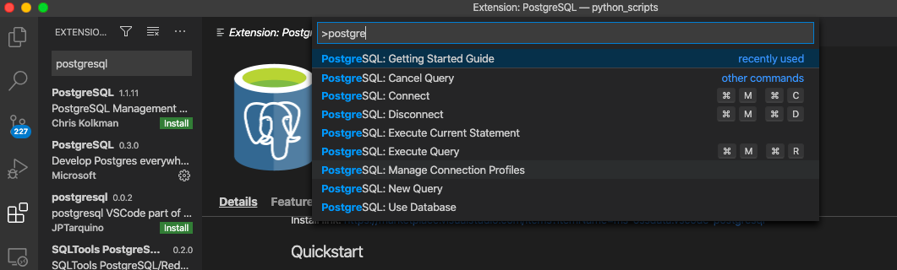
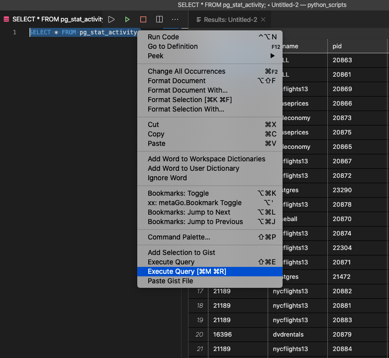

# Connect VS Code to PostgreSQL 
Visual Studio Code (VS Code) is a very pwoerful IDE used by Windows and Mac users alike. These instructions were created on a Mac, so slight variations may exist for Windows users.

Steps:
1. Install the PostgreSQL extension in VS Code.
2. Connect to the Server
3. Write a query 

## 1. Installing PostgreSQL
Open VScode open the Extensions in the left panel and search for PostgreSQL. Select the one authored by Microsoft, click the green install button.

## 2. Connect to the Thinkful Server

1) Open the Command Palette (Ctrl + Shift + P) in VS Code.

2) Search and select 'PostgreSQL: New Query'

3) In the command palette, select 'Create Connection Profile'.  
Use these connection details following the prompts to enter your Postgres instance's hostname, database, username, and password:
	-   **Host name/address:**  142.93.121.174
	-   **Port:**  5432
	-   **Username:**  dabc_student
	-   **Password:**  7*.8G9QH21

Once you're connected you will see the connection details at the bottom of your VS Code Window.

## 3. Write a query
Type this query into the new SQL script in VS Code to confirm you're connected 
   
`SELECT * FROM pg_stat_activity;` 

Highlight the query and Right-click, select 'Execute Query' and the results will show in a new window in VS Code.

You can save queries as SQL files and the query results as JSON, csv or Excel.

---

In case you need it here is the [Install link]( https://marketplace.visualstudio.com/items?itemName=ms-ossdata.vscode-postgresql).

<!--stackedit_data:
eyJoaXN0b3J5IjpbMTczMDIyMTAyOSwxNjI2OTI2MzAzLDExNj
E0ODcwOSw2MDg0MDc3OSwtMTkwMDkyOTc0MSwxMTcwNzc5NDkw
LC0xNDExNDU1NTU4LDI4MTQ1NzgzMF19
-->