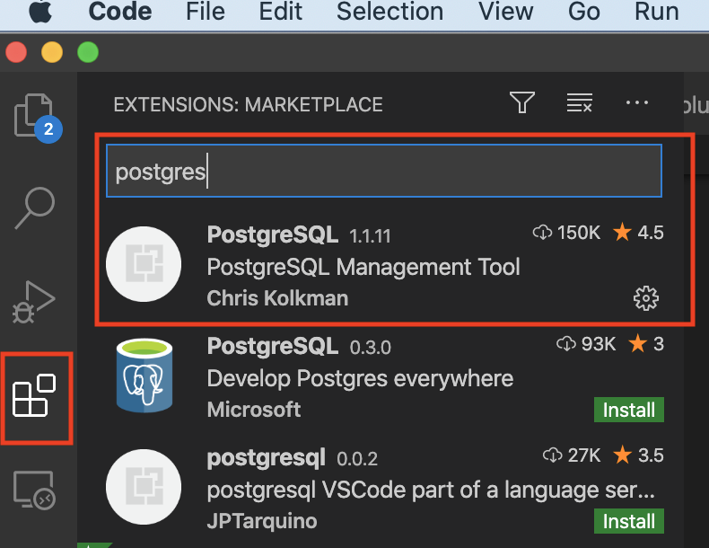

Vscode is very pwoerful IDE used by Windows and Mac lovers alike. These instructions were created for Mac users. 
Steps:
1. Install the PostgreSQL add on in VSCode.
2. Connect to the server
3. Write a query and get some data

## 1. Installing PostgreSQL
Open VScode open the Extensions in the left panel and search for PostgreSQL. Select the one authored by Microsoft, click the green install button.

Install link: https://marketplace.visualstudio.com/items?itemName=ms-ossdata.vscode-postgresql 

## 2. Connect to the Thinkful Server

1) Open the Command Palette (Ctrl + Shift + P) in VScode.

2) Search and select 'PostgreSQL: New Query'

3) In the command palette, select 'Create Connection Profile'.  
Use these connection details:
-   **Host name/address:**  142.93.121.174
-   **Port:**  5432
-   **Username:**  dabc_student
-   **Password:**  7*.8G9QH21
Follow the prompts to enter your Postgres instance's hostname, database, username, and password.

You are now connected to your Postgres database. You can confirm this via the Status Bar (the ribbon at the bottom of the VS Code window). It will show your connected hostname, database, and user.

4) You can type a query like 'SELECT * FROM pg_stat_activity';

5) Right-click, select 'Execute Query' and the results will show in a new window.

You can save the query results to JSON, csv or Excel.

<!--stackedit_data:
eyJoaXN0b3J5IjpbNTU4ODUyMTg0LDYwODQwNzc5LC0xOTAwOT
I5NzQxLDExNzA3Nzk0OTAsLTE0MTE0NTU1NTgsMjgxNDU3ODMw
XX0=
-->