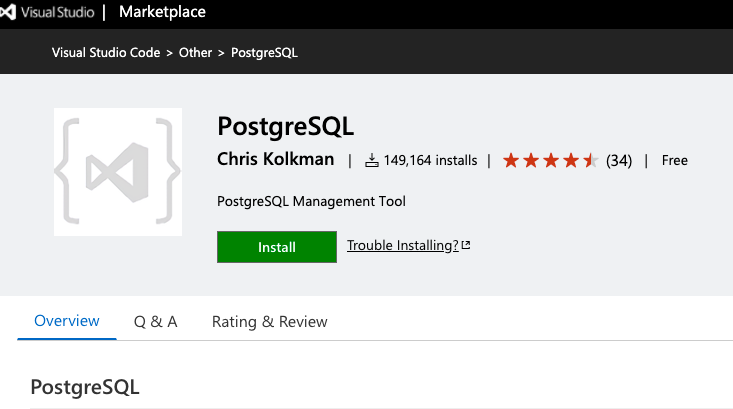

Vscode is very pwoerful IDe used by Windows and Mac lovers alike. These instructions were created for Mac users. 
Steps:
1. Install the PostgreSQL add on in VScode.
2. Connect to the database
3. write a query and get some data

## 1. Installing PostgreSQL
Go to the visual Studio marketplace and search for PostgreSQL. Click the install button on the Add on.
 

<!--stackedit_data:
eyJoaXN0b3J5IjpbMTE3MDc3OTQ5MCwtMTQxMTQ1NTU1OCwyOD
E0NTc4MzBdfQ==
-->